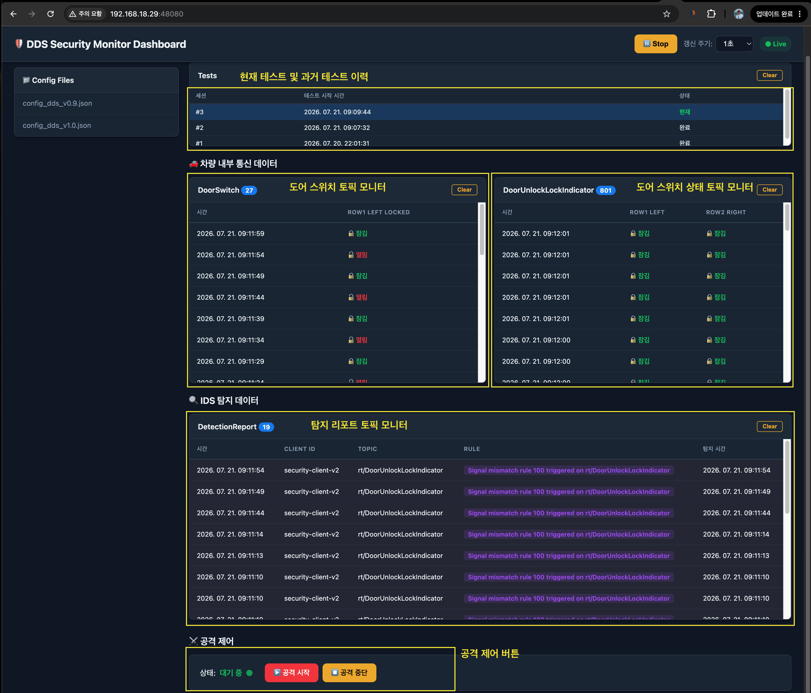

# dds-ids

## 1. 개요

이 프로젝트는 Fast DDS 기반의 SecurityClient / SecurityManager 예제를 Conan + CMake로 빌드하는 구조입니다.

주요 빌드 결과물:

- SecurityManager
- SecurityClient
- 설정 파일: policy_rule/config_dds_v0.9.json, policy_rule/config_dds_v1.0.json

## 2. 사전 준비

다음 도구가 설치되어 있어야 합니다.

- Conan 2.x
- CMake 3.21 이상
- GCC 11 이상 또는 호환되는 C++17 컴파일러
- make 또는 Ninja
- Python 3

## 3. Conan 초기화

먼저 프로젝트 루트로 이동합니다.

```bash
conan profile detect --force
```

Conan 원격 저장소를 등록합니다.

```bash
conan remote add oss https://gitlab.com/api/v4/projects/83664124/packages/conan --force
```

등록 결과를 확인합니다.

```bash
conan remote list
```

기존 원격 저장소를 바꾸고 싶다면 다음처럼 갱신할 수 있습니다.

```bash
conan remote update oss url https://gitlab.com/api/v4/projects/83664124/packages/conan
```

## 4. 의존성 설치

### Release 빌드용 의존성 설치

```bash
conan install . --build=missing -s build_type=Release -s compiler.cppstd=gnu17
```

### Debug 빌드용 의존성 설치

```bash
conan install . --build=missing -s build_type=Debug -s compiler.cppstd=gnu17
```

이 단계가 끝나면 [build/Release](build/Release) 또는 [build/Debug](build/Debug) 아래에 Conan 생성 파일이 만들어집니다.

### 컴파일 환경 설정
```
source build/Release/generators/conanbuild.sh
```
```
source build/Debug/generators/conanbuild.sh
```

## 5. Release 빌드

Release 빌드는 다음 순서로 진행합니다.

```bash
cmake --preset conan-release
cmake --build --preset conan-release
```

빌드 결과물은 [build/Release/bin](build/Release/bin) 아래에 생성됩니다.

## 6. Debug 빌드

Debug 빌드는 다음처럼 진행합니다.

```bash
cmake --preset conan-debug
cmake --build --preset conan-debug
```

빌드 결과물은 [build/Debug/bin](build/Debug/bin) 아래에 생성됩니다.

## 7. 실행 방법

### 1) SecurityManager 실행

```bash
./build/Release/bin/SecurityManager -s 0 -d 1
```

또는 Debug 바이너리로 실행합니다.

```bash
./build/Debug/bin/SecurityManager -s 0 -d 1
```

### 2) SecurityClient 실행

```bash
./build/Release/bin/SecurityClient \
  -i security-client-v2 \
  -d 0 \
  -c policy_rule/config_dds_v1.0.json \
  -r SecurityClient/config/sample_runtime_config.json
```

Debug 빌드를 사용한다면 다음처럼 실행합니다.

```bash
./build/Debug/bin/SecurityClient \
  -i security-client-v2 \
  -d 0 \
  -c policy_rule/config_dds_v1.0.json \
  -r SecurityClient/config/sample_runtime_config.json
```

실행 시 `-i` 는 클라이언트 식별자, `-d` 는 DDS 도메인, `-c` 는 정책 설정 파일, `-r` 은 런타임 설정 파일입니다.

## 8. 설치하기

빌드된 실행 파일을 프로젝트 루트의 bin 디렉터리에 설치하려면 다음 명령을 사용합니다.

```bash
cmake --install build/Release
```

```bash
cmake --install build/Debug
```

설치된 실행 파일은 [bin](bin) 아래에 생성됩니다.

## 9. 테스트 실행(선택)

```bash
ctest --test-dir build/Release --output-on-failure
```

```bash
ctest --test-dir build/Debug --output-on-failure
```

## 10. OSS-IDS Docker test 환경 (For Linux/macOS)
### 요약
- test 환경은 세 부분으로 나뉩니다.
  - **security_processor**: security client, security manager 를 구동한다.
  - **attack_env**: 정상 DDS 환경을 구축하고, attack 을 수행할 수 있는 환경을 구동한다.
  - **security_monitor**: 현재 DDS 환경을 모니터링하고, attack 을 동작/중단 할 수 있는 frontend 를 제공한다.
- [주의] 테스트 도커 이미지는 현재 프로젝트에서 빌드된 바이너리를 포함하는 docker 빌드를 진행하지 않고, 사내 빌드환경에서 현 github 최신버전에 맞게 docker 빌드하여 push된 이미지임.

### OSS-IDS Docker test 환경 구축
- `cd docker`
- 아래와 같이 GitHub에 로그인 (PAT 발급은 AI or googling)
```bash
export CR_PAT='*** GitHub PAT classic ***'
printf '%s' "$CR_PAT" | docker login ghcr.io -u <github-user> --password-stdin
unset CR_PAT
```
- 도커 이미지 pull
```bash
IMAGE_ARCH="$(arch=$(uname -m); case "$arch" in x86_64) echo amd64 ;; aarch64|arm64) echo arm64 ;; *) echo "$arch" ;; esac)" docker compose pull
```
- 도커 서비스 up
```bash
IMAGE_ARCH="$(arch=$(uname -m); case "$arch" in x86_64) echo amd64 ;; aarch64|arm64) echo arm64 ;; *) echo "$arch" ;; esac)" docker compose up -d
```
  - 만약 테스트 환경 없이 security client and manager 만 필요하다면 다음처럼 실행:
```bash
IMAGE_ARCH="$(arch=$(uname -m); case "$arch" in x86_64) echo amd64 ;; aarch64|arm64) echo arm64 ;; *) echo "$arch" ;; esac)" docker compose up -d security_processor
```
- 브라우저에서 http://host-ip:48080 접속

